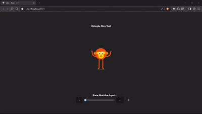

# React Rive Testing Project

This repository is dedicated to testing and demonstrating Rive features with React, specifically focusing on **Solos** and **State Machines** for dynamic asset manipulation.

## 🎯 Project Overview

This project showcases how to integrate Rive animations with React using the `@rive-app/react-canvas` library. It demonstrates two main approaches for controlling Rive assets:

1. **Solos** - Direct animation control for switching between different visual states
2. **State Machines** - Programmatic control using Rive's state machine system

## 🎬 Demo



## 🚀 Features

### Solos Implementation Not working properly (lack of documentation) (`ChimpleRive.tsx`)

- Direct animation control using Rive's solo system
- Real-time visual feedback showing current selections
- Button-based interface for testing different combinations

### State Machine Implementation (`ChimpleRiveWithStateMachine.tsx`)
- Dynamic switching between different character accessories (hats, shoes)
- Number input control (0-8 range) for state machine manipulation
- Smooth slider and button controls for testing
- Real-time synchronization between React state and Rive state machine
- Demonstrates how to bind state machine inputs to React components

## 📁 Project Structure

```
src/
├── App.tsx                           # Main application component
├── ChimpleRive.tsx                   # Solos only implementation
├── ChimpleRiveWithStateMachine.tsx   # Solos with State machine implementation


public/
├── mascot_solos.riv                  # Rive file for solos testing
└── mascot_state_machine.riv          # Rive file for state machine testing
```

## 🛠️ Technologies Used

- **React 19** - Modern React with hooks
- **TypeScript** - Type-safe development
- **Vite** - Fast build tool and dev server
- **@rive-app/react-canvas** - Official Rive React integration
- **@rive-app/canvas** - Core Rive canvas functionality

## 🚀 Getting Started

### Prerequisites
- Node.js (version 16 or higher)
- npm or yarn

### Installation

1. Clone the repository:
```bash
git clone https://github.com/manish7532/react-rive-solos_with_stateMachine.git
cd react-rive-solos_with_stateMachine
```

2. Install dependencies:
```bash
npm install
```

3. Start the development server:
```bash
npm run dev
```

4. Open your browser and navigate to `http://localhost:5173`

## 🎮 Usage

### Testing Solos
- The main interface shows a character with interactive controls
- Use the "Head Gear" buttons to switch between different hat options
- Use the "Shoes" buttons to change footwear
- Current selections are displayed in real-time

### Testing State Machine
- Use the slider or +/- buttons to control the state machine input
- Values range from 0 to 8 to change solos(hats/shoes)
- Watch the character animation respond to state changes
- The interface shows the current numeric value

## 🔧 Available Scripts

- `npm run dev` - Start development server
- `npm run build` - Build for production
- `npm run lint` - Run ESLint
- `npm run preview` - Preview production build

## 📝 Notes

- The project includes both `.riv` files needed for testing
- Components can be easily switched in `App.tsx` by uncommenting different imports
- The inspector component is available but currently commented out
- All Rive interactions are logged to the console for debugging